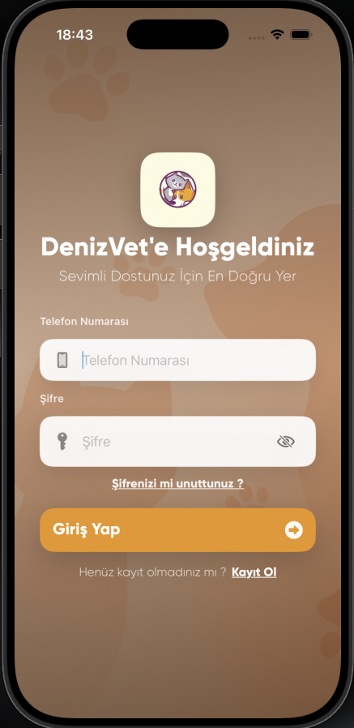
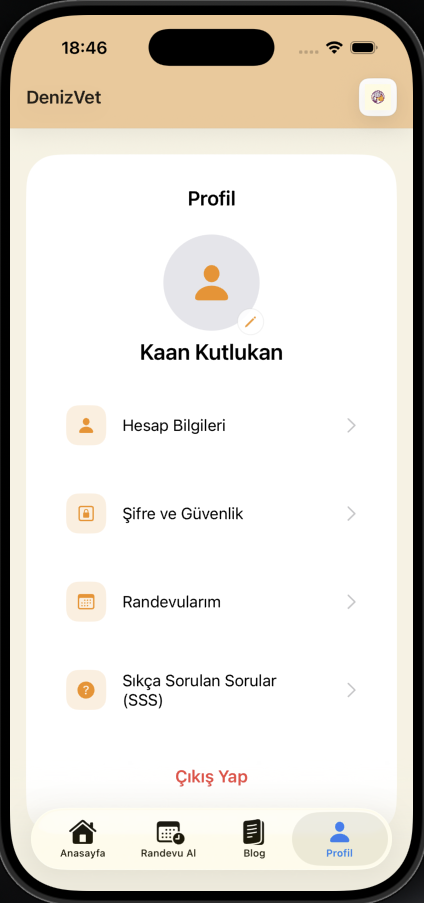
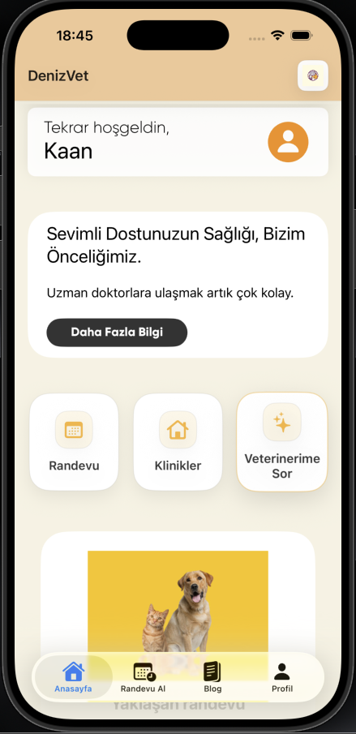
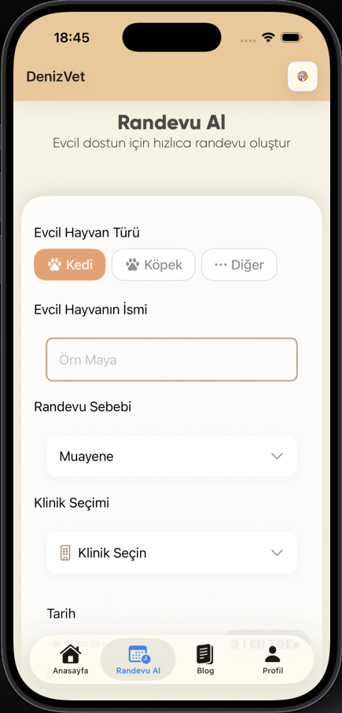
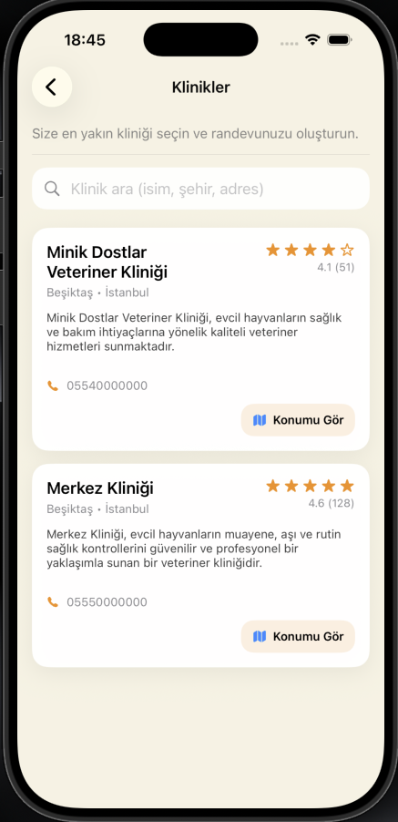
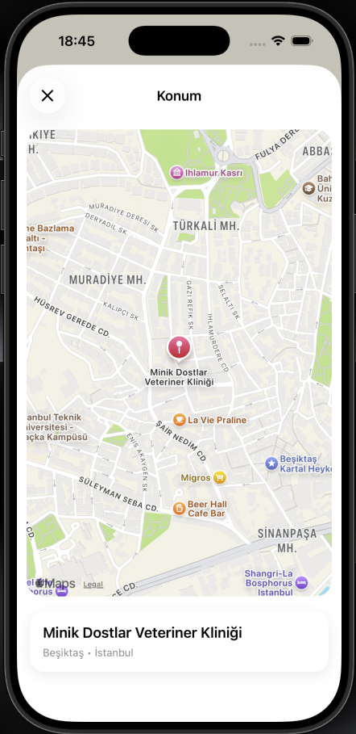
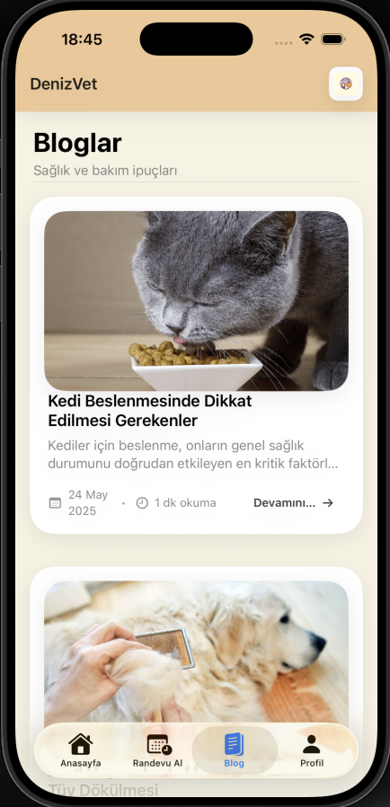

DenizVet iOS Application

DenizVet is a modern iOS mobile application designed to simplify veterinary appointment management for pet owners and veterinary clinics. The application is built using SwiftUI and follows the MVVM architecture pattern, focusing on clean code, scalability, and real-world usability.

This repository contains the iOS client of the DenizVet system and is shared for academic and portfolio purposes.

---

Screenshots

  
  
  
  

  
  
  
  

---

Features

- User authentication (login and registration)
- User profile management
- Veterinary clinic listing
- Appointment booking and management
- Clinic location display with map integration
- Blog and informational content
- Modular SwiftUI interface
- MVVM architecture with service-based networking

---

Getting Started

Prerequisites

- macOS with Xcode installed
- iOS Simulator or a physical iOS device
- Backend service running locally or accessible via a configured base URL

Installation

Clone the repository:

git clone https://github.com/DenizOzcan04/DenizVet-iOS.git  
cd DenizVet-iOS

Open the project in Xcode.  
Select a simulator or a connected device and build the project using Cmd + R.

---

Architecture

The application follows the MVVM (Model-View-ViewModel) architecture pattern:

Model  
Represents the data structures and business models.

View  
SwiftUI views responsible for rendering the user interface.

ViewModel  
Handles business logic, API communication, and state management between the Model and the View.

The project is structured to ensure separation of concerns and long-term maintainability.

---

Project Structure

DenizVetMobile  
├── Models  
├── Network  
├── ViewModels  
├── Views  
│   └── Components  
├── Assets  
├── Fonts  

---

Backend Integration

- Communicates with a RESTful backend API
- Base URL is currently configured for local development
- No production secrets or API keys are included in this repository

---

Purpose

This project is developed for:

- Academic coursework
- Portfolio and CV presentation
- Technical demonstration of iOS development skills

---

Future Improvements

- Mobile clinic management features
- AI-powered assistant for pet care
- Navigation and route guidance
- Advanced appointment workflows

---

License

All rights reserved.  
This repository is shared for educational and demonstration purposes only.
